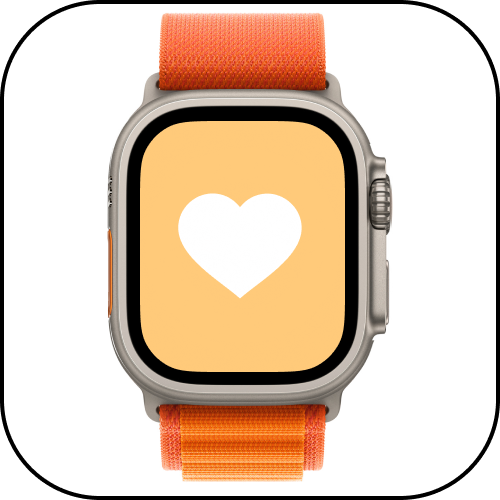
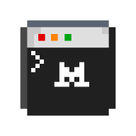

<table align="center" border="0" cellspacing="0" cellpadding="30"><tr>
  <td align="center"></td>
  <td align="center" style="padding: 0;"></td>
  <td align="center"></td>
</tr></table>

<h1 align="center">V.I.T.A.L</h1>

  <strong>Voice-Integrated Tracker & Adaptive Listener</strong> 
  <em>Your health data talks. V.I.T.A.L listens.</em>

  
  
  
  
  

  
  &nbsp;&nbsp;
  

---
> This POC validates for the [**Alan x Mistral AI Health Hack**](https://luma.com/t7rspaka) — April 11, 2026 in Paris.

  

A voice-first health assistant that plugs into your Apple Watch, gets your data, and actually talks back.  
Ask for something. It looks at your Apple Watch data and answers out loud. That's it.

## Why

Millions of people wear a smartwatch. Every one of them collects heart rate, sleep, SpO2, steps — 24/7, passively. That's an insane amount of personal health data.

And yet — almost nobody actually *uses* or *understand* it. You glance at a ring, check a number, swipe away. The data sits there. You don't know what a 45ms HRV means. Apps give you charts, not answers.

V.I.T.A.L flips this: ask "how did I sleep?" and get an actual spoken answer grounded in *your* real data — not a generic article, not a color-coded ring. A conversation.

## Powered by

<table>
  <tr>
    <td align="center"> <strong>Mistral Small</strong> Reasoning</td>
    <td align="center"> <strong>Voxtral</strong> Voice</td>
    <td align="center"> <strong>Devstral</strong> Code companion</td>
  </tr>
</table>

## What's next

Goal: go from CLI prototype to native iOS + Apple Watch with direct HealthKit integration, real-time monitoring, and proactive health alerts.

## License

MIT
