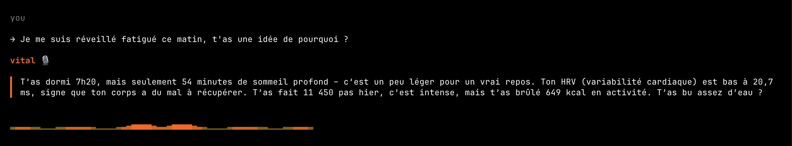

  
  &nbsp;&nbsp;&nbsp;&nbsp;
  

<h1 align="center">V.I.T.A.L</h1>

  <strong>Voice-Integrated Tracker & Adaptive Listener</strong> 
  <em>The first health checkup that listens to how you feel AND measures what your body says.</em>

  
  
  
  

  
  &nbsp;&nbsp;
  

---

> Built for the [**Alan x Mistral AI Health Hack**](https://luma.com/t7rspaka) — April 11, 2026 in Paris.

## The problem

Absenteeism costs French companies €120B/year. 36% of long-term sick leave is stress and burnout. Companies have no objective way to prevent it — existing health assessments rely on self-reported questionnaires that people fill once and forget.

## The solution

V.I.T.A.L is a vocal health checkup that crosses what you feel (your voice) with what your body measures (Apple Watch / HealthKit), to detect burnout before it happens.

  

→ **You talk** — "How am I doing this week?"
→ **It measures** — HRV, heart rate, sleep, activity from your Watch
→ **It crosses** — "You say you're fine but your HRV dropped from 48 to 22ms"
→ **It acts** — "Want me to book a psychologist? It's covered by your plan."

Works with Apple Watch for full biometric data, or with iPhone Health app alone for users without a Watch.

### Two rituals, no noise

→ **Weekly vocal checkup** — a 2-minute structured conversation that crosses 7 days of biometrics with three subjective questions, producing a burnout score and one concrete action.
→ **Smart daily nudge** — V.I.T.A.L only pings you when your body actually shows a stress signal (HRV drop, short sleep, elevated resting HR). No daily nag. You earn rewards only when listening to your body matters.

## Powered by

<table>
  <tr>
    <td align="center"> <strong>Mistral Small 4</strong> Reasoning + Tool Use</td>
    <td align="center"> <strong>Voxtral</strong> Voice (STT + TTS)</td>
    <td align="center"> <strong>Devstral</strong> Code companion</td>
  </tr>
</table>

## Health metrics

20 metrics across 5 categories — vitals, activity, sleep, environment, mindfulness.  
See [docs/health-metrics.md](docs/health-metrics.md) for the full dictionary.

## Privacy

Zero personal identifiers sent to the LLM — only anonymous aggregated metrics.  
See [docs/privacy-rgpd.md](docs/privacy-rgpd.md).

## License

MIT
